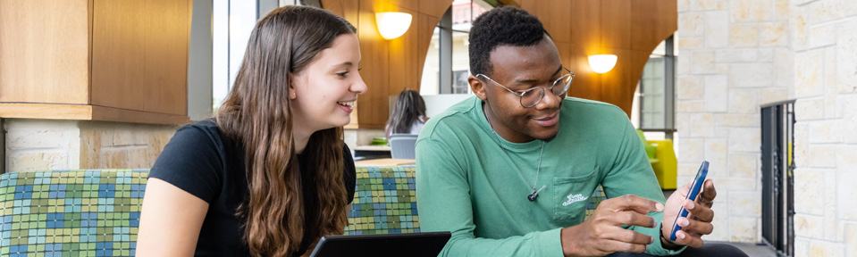

[Skip to Main Content](https://www.usf.edu/admissions/freshmen/next-steps/index.aspx#content)

[University of South Florida](https://www.usf.edu/)

## [Freshmen](https://www.usf.edu/admissions/freshmen/)

[Office of Admissions](https://www.usf.edu/admissions/)

[Show

Search](https://www.usf.edu/admissions/freshmen/next-steps/index.aspx)

Search for:

## Main Navigation

[Show Menu](https://www.usf.edu/admissions/freshmen/next-steps/index.aspx)

[Give Now](https://giving.usf.edu/)

* [Show Admission Information](https://www.usf.edu/admissions/freshmen/next-steps/index.aspx)

  + [Freshmen Admissions Information](https://www.usf.edu/admissions/freshmen/admission-information/index.aspx)
  + [How to Apply](https://www.usf.edu/admissions/freshmen/admission-information/how-to-apply.aspx)
  + [Dates and Deadlines](https://www.usf.edu/admissions/freshmen/admission-information/dates-deadlines.aspx)
  + [Academic Requirements](https://www.usf.edu/admissions/freshmen/admission-information/academic-requirements.aspx)
  + [Scholarships](https://www.usf.edu/admissions/freshmen/admission-information/cost-of-attendance/scholarships.aspx)

  + [Cost of Attendance](https://www.usf.edu/admissions/freshmen/admission-information/cost-of-attendance/index.aspx)
  + [Residency Information](https://www.usf.edu/admissions/freshmen/admission-information/residency-information.aspx)
  + [Explore Programs](https://www.usf.edu/admissions/freshmen/admission-information/explore-programs.aspx)
  + [Non-Degree Seeking Students](https://www.usf.edu/admissions/freshmen/admission-information/non-degree-seeking-students.aspx)
  + [For Counselors](https://www.usf.edu/admissions/freshmen/admission-information/counselor-information.aspx)

  + [College Planning](https://www.usf.edu/admissions/freshmen/admission-information/college-planning.aspx)
  + [Why USF?](https://www.usf.edu/admissions/freshmen/admission-information/why-usf.aspx)
* [Visit Campus](https://www.usf.edu/admissions/visit/index.aspx)
* [Show Next Steps](https://www.usf.edu/admissions/freshmen/next-steps/index.aspx)

  + [Admitted Student Next Steps](https://www.usf.edu/admissions/freshmen/next-steps/index.aspx)
  + [Applicant Next Steps](https://www.usf.edu/admissions/freshmen/next-steps/check-application-status.aspx)
  + [Submit Deposit](https://www.usf.edu/admissions/freshmen/next-steps/submit-deposit.aspx)
  + [Submit Transcripts](https://www.usf.edu/admissions/freshmen/next-steps/submit-transcripts.aspx)
  + [Apply for Financial Aid](https://www.usf.edu/financial-aid/)

  + [Understanding Your Decision](https://www.usf.edu/admissions/freshmen/next-steps/understanding-your-decision.aspx)
* [Contact Us](https://www.usf.edu/admissions/freshmen/contact-us/)
* [Apply Now](https://discover.usf.edu/portal/application?utm_source=quick-links&utm_campaign=prospect&utm_content=apply&utm_medium=digital)

* [MyUSF](https://my.usf.edu/)
* [Directory](https://directory.usf.edu/)

# Next Steps

[Skip Over Breadcrumbs and Secondary Navigation](https://www.usf.edu/admissions/freshmen/next-steps/index.aspx#content-title)

## Breadcrumb Navigation

* [Freshmen](https://www.usf.edu/admissions/freshmen)
* [Next Steps](https://www.usf.edu/admissions/freshmen/next-steps)
* Admitted Student Next Steps

[Show  Secondary Navigation](https://www.usf.edu/admissions/freshmen/next-steps/index.aspx)

* [Admitted Student Next Steps](https://www.usf.edu/admissions/freshmen/next-steps/index.aspx "Admitted Student Next Steps")
* [Applicant Next Steps](https://www.usf.edu/admissions/freshmen/next-steps/check-application-status.aspx)
  + [Grandparent Waiver](https://www.usf.edu/admissions/freshmen/next-steps/grandparent-waiver.aspx)
* [Submit Deposit](https://www.usf.edu/admissions/freshmen/next-steps/submit-deposit.aspx)
* [Submit Transcripts](https://www.usf.edu/admissions/freshmen/next-steps/submit-transcripts.aspx)
* [Campus Assignment](https://www.usf.edu/admissions/freshmen/next-steps/campus-assignment.aspx)
* [Understanding Your Decision](https://www.usf.edu/admissions/freshmen/next-steps/understanding-your-decision.aspx)

## Quick Links

* [Request More Information](https://discover.usf.edu/register/undergraduate-admissions-info)
* [Apply Now](https://admissions.usf.edu/application?&utm_source=quick-links&utm_campaign=prospect&utm_content=apply&utm_medium=digital)
* [Dates & Deadlines](https://www.usf.edu/admissions/freshmen/admission-information/dates-deadlines.aspx)
* [Schedule a Visit](https://www.usf.edu/admissions/visit/index.aspx)

## Admitted Student Next Steps

### Access the USF Applicant Portal

The USF Applicant Portal is a central location where you can track your application
progress, access required forms and see what documents you still need to submit.

### Spring 2026 Applicants

If you've applied to USF for the Spring 2026 term, you can check your application
status, submit documents and receive important updates in our [Legacy Applicant Portal](http://admissions.usf.edu/applicant-portal).

[Visit the Legacy Applicant Portal](http://admissions.usf.edu/applicant-portal)

If you have applied for Summer or Fall 2026, you can see updates about your application
status in the [new USF Applicant Portal](https://discover.usf.edu/apply/status). Remember to check it often!

[Open the New Applicant Portal](https://discover.usf.edu/apply/status)

If you are admitted to USF, you will receive a notification via email and/or postal
mail. Check your email and applicant portal often for updates to your USF application!

---

### Submit Your Deposit

Submitting the $200 nonrefundable admissions deposit confirms your intent to enroll
at USF and reserves your space for the semester you were admitted to. This deposit
will be credited to your student account and applied toward your tuition.

**Note**: You will not be able to register for Orientation until the $200 admissions deposit
has been paid.

### WHEN TO DEPOSIT

[### Summer/Fall Deposit Deadline

May

1

Freshman students starting in the summer or fall semesters must submit their admissions
deposit by May 1 to save their spot at USF.

Submit My Deposit](https://admissions.usf.edu/myBullsPath)

[### Spring Deposit Deadline

Nov.November

1

Freshman students starting in the spring semester must submit their admissions deposit
by November 1 to save their spot at USF.

Submit My Deposit](https://admissions.usf.edu/myBullsPath)

---

### ✅ Next Steps: Tampa Campus

Congratulations on your admission to USF! We’re excited to introduce you to life at
our dynamic, metropolitan Tampa campus.

* **[Submit Deposit](https://admissions.usf.edu/myBullsPath):** Save your spot in the class by submitting your admission deposit or admission deposit
  waiver.
* **[Apply for Housing](https://www.usf.edu/housing/index.aspx):** If you want to live on campus, make sure to apply by the priority deadline.
* **[Submit Medical History](https://www.usf.edu/student-affairs/student-health-services/immunizations/):** Work with your health care provider to complete this form, which we must receive
  before you can register for classes.
* **[Reserve Orientation Date](https://www.usf.edu/orientation/ftic/tampa.aspx):** You’ll register for your first-semester courses at Orientation, so sign up early
  for the best selection.
* **[Submit Transcripts](https://www.usf.edu/admissions/freshmen/next-steps/submit-transcripts.aspx):** Final official high school transcripts reflecting your graduation date must be submitted
  before your first day of classes, along with any optional AP, IB or AICE courses you
  may have completed.
* **[Apply for Accessibility Accommodations (Optional - As needed)](https://www.usf.edu/student-affairs/student-accessibility/index.aspx):** First-year students may apply for accommodations once admitted to the University of
  South Florida. Students are responsible for identifying themselves to Student Accessibility
  Services and presenting proper medical documentation to receive academic accommodations.

[View My Onboarding Checklist](https://admissions.usf.edu/myBullsPath)

---

### ✅ Next Steps: St. Petersburg Campus

Congratulations on becoming a USF Bull! We think you’ll love life at our waterfront
campus in the heart of stunning St. Petersburg.

* **[Submit Deposit](https://admissions.usf.edu/myBullsPath):** Save your spot in the class by submitting your admission deposit or admission deposit
  waiver.
* **[Apply for Housing](https://www.stpetersburg.usf.edu/student-life/housing/index.aspx):** If you want to live on campus, make sure to apply by the priority deadline.
* **[Submit Medical History](https://www.stpetersburg.usf.edu/student-life/wellness/medical-services/immunization-requirements.aspx):** Work with your health care provider to complete this form, which we must receive
  before you can register for classes.
* **[Reserve Orientation Date](https://www.usf.edu/orientation/ftic/st-petersburg.aspx):** You’ll register for your first-semester courses at Orientation, so sign up early
  for the best selection.
* **[Submit Transcripts](https://www.usf.edu/admissions/freshmen/next-steps/submit-transcripts.aspx):** Final official high school transcripts reflecting your graduation date must be submitted
  before your first day of classes, along with any optional AP, IB or AICE courses you
  may have completed.
* **[Apply for Accessibility Accommodations (Optional - As needed)](https://www.usf.edu/student-affairs/student-accessibility/index.aspx):** First-year students may apply for accommodations once admitted to the University of
  South Florida. Students are responsible for identifying themselves to Student Accessibility
  Services and presenting proper medical documentation to receive academic accommodations.

*Note: If you applied to the Tampa campus, learn more about why you were [assigned to the St. Petersburg campus](https://www.usf.edu/admissions/freshmen/next-steps/campus-assignment.aspx).*

[View My Onboarding Checklist](https://admissions.usf.edu/myBullsPath)

---

### ✅ Next Steps: Sarasota-Manatee Campus

Congratulations on joining the Herd! We’re ready to welcome you to the tight-knit
Sarasota-Manatee campus, where professors know students by name.

* **[Submit Deposit](https://admissions.usf.edu/myBullsPath):** Save your spot in the class by submitting your admission deposit or admission deposit
  waiver.
* **[Apply for Housing](https://www.sarasotamanatee.usf.edu/housing/index.aspx):** If you want to live on campus, make sure to apply by the priority deadline.
* **[Submit Medical History](https://www.sarasotamanatee.usf.edu/campus-life/health-and-safety/counseling-and-wellness-center/immunization-assistance.aspx):** Work with your health care provider to complete this form, which we must receive
  before you can register for classes.
* **[Reserve Orientation Date](https://www.usf.edu/orientation/ftic/sarasota-manatee.aspx):** You’ll register for your first-semester courses at Orientation, so sign up early
  for the best selection.
* **[Submit Transcripts](https://www.usf.edu/admissions/freshmen/next-steps/submit-transcripts.aspx):** Final official high school transcripts reflecting your graduation date must be submitted
  before your first day of classes, along with any optional AP, IB or AICE courses you
  may have completed.
* **[Apply for Accessibility Accommodations (Optional - As needed)](https://www.usf.edu/student-affairs/student-accessibility/index.aspx):** First-year students may apply for accommodations once admitted to the University of
  South Florida. Students are responsible for identifying themselves to Student Accessibility
  Services and presenting proper medical documentation to receive academic accommodations.

*Note: If you applied to the Tampa campus, learn more about why you were [assigned to the Sarasota-Manatee campus](https://www.usf.edu/admissions/freshmen/next-steps/campus-assignment.aspx).*

[View My Onboarding Checklist](https://admissions.usf.edu/myBullsPath)

---

[University of South Florida](https://www.usf.edu/)

[Show Menu](https://www.usf.edu/admissions/freshmen/next-steps/index.aspx)

* [About USF](https://www.usf.edu/about-usf/index.aspx)
* [Academics](https://www.usf.edu/academics/index.aspx)
* [Admissions](https://www.usf.edu/admissions/index.aspx)
* [Locations](https://www.usf.edu/locations/index.aspx)
* [Campus Life](https://www.usf.edu/campus-life/index.aspx)
* [Research](https://www.usf.edu/research/index.aspx)

* [Administrative Units](https://www.usf.edu/about-usf/administrative-units.aspx)
* [Regulations & Policies](https://www.usf.edu/regulations-policies/index.aspx)
* [Human Resources](https://www.usf.edu/hr/index.aspx)
* [Work at USF](https://jobs.usf.edu/)
* [Emergency & Safety](https://www.usf.edu/public-safety/emergency-management/index.aspx)
* [Title IX](https://www.usf.edu/title-ix/index.aspx)

* [USF Health](https://health.usf.edu/)
* [USF Athletics](https://gousfbulls.com/)
* [USF Alumni](https://www.usfalumni.org/)
* [Support USF](https://giving.usf.edu/)
* [USF Libraries](https://www.lib.usf.edu/)
* [USF World](https://www.usf.edu/world/index.aspx)

4202 E. Fowler Avenue, SVC 1036,
Tampa, FL 33620, USA
813-974-3350

* [Facebook](https://www.facebook.com/USouthFlorida/)
* [X](https://twitter.com/USouthFlorida)
* [YouTube](https://www.youtube.com/channel/UCHWvU2ERsXIYaiWKovLh-SA)
* [Instagram](https://www.instagram.com/usouthflorida/?hl=en)

Copyright [©](https://a.cms.omniupdate.com/11/?skin=usf&account=USFMainPROD&site=usf_edu&action=de&path=/admissions/freshmen/next-steps/index.pcf) 2025, University of South Florida. All rights reserved.

This website is maintained by Office of Admissions.

* [Privacy](https://www.usf.edu/about-usf/about-this-site.aspx)
* [Contact USF](https://www.usf.edu/about-usf/contact-usf.aspx)
* [Visit USF](https://www.usf.edu/about-usf/visit-usf.aspx?utm_source=visit-usf&utm_medium=footer&utm_campaign=usfcms)
* [Accessibility](https://www.usf.edu/about-usf/about-this-site.aspx#accessibility)